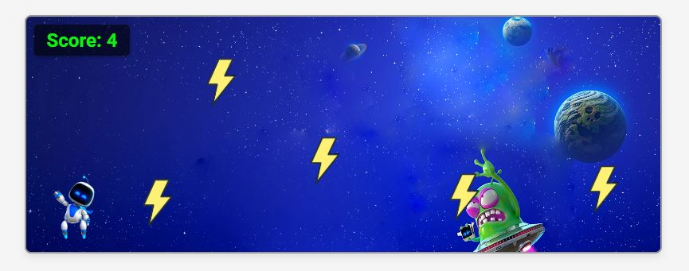

# Quizi The Spaceman


## How it works
#### The game is developed based on two main elements, which are obstacles **(lightning)** and a spaceman **(Quizi)**. The user must make sure to avoid all the lightning elements that will be generated automatically until he passes 20 elements to win!

## How to play
#### The game can be interacted with by pressing the _Start_ button and then using only the Keyboard keys:
* Use the up arrow button to move the Quizi up.
* Use the down arrow button to move the Quizi down.

## Overview


## Getting started
#### via the link of the [Game](https://mahmoodalnokhatha.github.io/Quizi/) 

## Technologies used
#### The game's development relies on three files along with specific features:
* HTML
* CSS
* Javascript
    * DOM Manipulation
    * Events
    * Loops
    * Variables & Scope
    * Browser APIs

## Highlights
#### 🧱 Padding utlization in JS
Padding in JavaScript is used to create safe space around Quizi to prevent early collision detection with Lightning.

```javascript
let padding = 10;

return !(
  (r1.top + padding) > (r2.bottom - padding) ||
  ...
);
```

